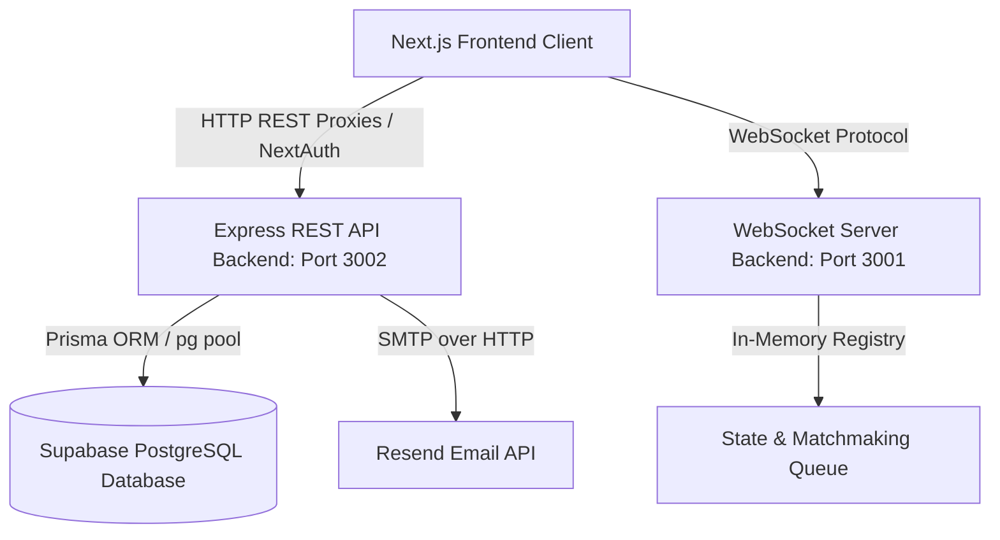
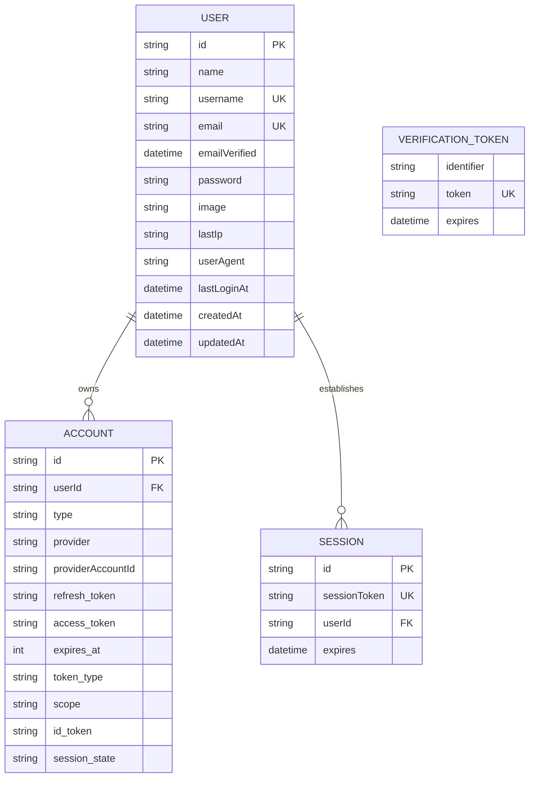

# Moots Engineering & System Architecture Documentation

Welcome to the official technical documentation for **Moots**. This document serves as the comprehensive source of truth for the system architecture, API schemas, database models, security controls, and operational workflows of the Moots platform.

---

## 1. System Architecture Design

Moots is architected as a decoupled, multi-tier system designed for real-time engagement, persistent user management, and high scalability.



### Component Breakdown
1. **Frontend Client (Next.js)**: Runs on port `3000`. Handles user interface rendering, credentials-based session validation using NextAuth, and maintains active state machines for matching/chatting.
2. **REST API Backend (Express)**: Runs on port `3002`. Exposes standard HTTP endpoints for authentication (registration, verification, login) and profile settings management. Integrates with Prisma Client for database queries and Resend for transactional OTP emails.
3. **WebSocket Server (ws)**: Runs on port `3001`. Handles stateful, real-time channels, matchmaking algorithms, messaging routing, and presence tracking.
4. **Database Tier (Supabase PostgreSQL)**: Fully hosted relational database for user profile metadata, authentication credentials, and session tracking.

---

## 2. Database Schema (Prisma)

Data models are configured in `backend/api/prisma/schema.prisma` and applied using Prisma CLI.

### Entity Relationship Diagram (Conceptual)


### Table Definitions

#### `User` Model
Represents registered users in the system.

| Field | Type | Attributes | Description |
| :--- | :--- | :--- | :--- |
| `id` | `String` | `@id`, `@default(cuid())` | Unique user identifier |
| `name` | `String?` | | Display name of the user |
| `username` | `String?` | `@unique` | Enforced unique user handle |
| `email` | `String?` | `@unique` | Registered email address |
| `emailVerified`| `DateTime?` | | Timestamp of email verification |
| `password` | `String?` | | Bcrypt-hashed credentials |
| `image` | `String?` | | Avatar image URL |
| `lastIp` | `String?` | | Last logged client IP address |
| `userAgent` | `String?` | | Last logged user-agent string |
| `lastLoginAt` | `DateTime?` | | Timestamp of last successful login |
| `createdAt` | `DateTime` | `@default(now())` | Creation timestamp |
| `updatedAt` | `DateTime` | `@updatedAt` | Last update timestamp |

---

## 3. REST API Specification (Port 3002)

The Express REST API server handles all authentication and account management operations.

### Authentication Flow
```
User (Client) ──► /api/auth/register (POST) ──► Generates OTP & Sends Email via Resend
User (Client) ──► /api/auth/verify-otp (POST) ──► Marks emailVerified in DB
User (Client) ──► /api/auth/login (POST) ──► Validates Bcrypt hash & Returns User object
```

### Endpoints

#### 1. Register User
* **URL**: `/api/auth/register`
* **Method**: `POST`
* **Content-Type**: `application/json`
* **Request Payload**:
  ```json
  {
    "email": "user@example.com",
    "password": "SecurePassword123"
  }
  ```
* **Success Response (200 OK)**:
  ```json
  {
    "message": "Registration successful. OTP sent."
  }
  ```
* **Error Response (400 Bad Request)**:
  ```json
  {
    "error": "Email is already registered and verified"
  }
  ```

#### 2. Verify OTP
* **URL**: `/api/auth/verify-otp`
* **Method**: `POST`
* **Content-Type**: `application/json`
* **Request Payload**:
  ```json
  {
    "email": "user@example.com",
    "otp": "582910"
  }
  ```
* **Success Response (200 OK)**:
  ```json
  {
    "message": "Email verified successfully"
  }
  ```
* **Error Response (400 Bad Request)**:
  ```json
  {
    "error": "Invalid OTP code"
  }
  ```

#### 3. Credentials Login (NextAuth Proxy Target)
* **URL**: `/api/auth/login`
* **Method**: `POST`
* **Content-Type**: `application/json`
* **Request Payload**:
  ```json
  {
    "identifier": "user@example.com", 
    "password": "SecurePassword123"
  }
  ```
  *(Note: `identifier` can be either the email address or the username).*
* **Success Response (200 OK)**:
  ```json
  {
    "user": {
      "id": "cuid12345",
      "name": "John Doe",
      "email": "user@example.com",
      "image": null,
      "username": "johndoe"
    }
  }
  ```

#### 4. Update Profile Settings
* **URL**: `/api/user/settings`
* **Method**: `PUT`
* **Content-Type**: `application/json`
* **Request Payload**:
  ```json
  {
    "userId": "cuid12345",
    "username": "new_username",
    "name": "New Display Name"
  }
  ```
* **Success Response (200 OK)**:
  ```json
  {
    "message": "Profile updated successfully",
    "user": {
      "id": "cuid12345",
      "username": "new_username",
      "name": "New Display Name"
    }
  }
  ```

---

## 4. WebSocket Protocol Specification (Port 3001)

The WebSocket server provides bidirectional, message-oriented communication for live matchmaking and active chatting. All payloads must follow strict structural interfaces.

### Message Packaging format
All messages sent and received over WebSocket are JSON packets formatted as follows:
```json
{
  "type": "event_name",
  "payload": {}
}
```

### Event Codes Reference

| Message Type | Direction | Description | Payload Structure |
| :--- | :--- | :--- | :--- |
| `JOIN_QUEUE` | Client -> Server | Enters client into matchmaking queue | `{ "interests": ["gaming", "music"] }` |
| `LEAVE_QUEUE` | Client -> Server | Removes client from queue | `{}` |
| `MATCH_FOUND` | Server -> Client | Notifies clients that a match was successfully made | `{ "sessionId": "session-uuid-123", "peerId": "peer-uuid" }` |
| `SEND_MESSAGE` | Client -> Server | Broadcasts a text message to the active peer | `{ "sessionId": "session-uuid-123", "text": "Hello!" }` |
| `RECEIVE_MESSAGE` | Server -> Client | Delivers peer message to active client | `{ "id": "msg-uuid", "text": "Hello!", "senderId": "peer-uuid", "timestamp": "2026-06-24T03:00:00Z" }` |
| `TYPING_STATUS` | Client -> Server | Broadcasts typing indicator status | `{ "sessionId": "session-uuid-123", "isTyping": true }` |
| `HEARTBEAT` | Client <-> Server | Continuous ping-pong connection health check | `{}` |

---

## 5. Security & Operational Runbook

This runbook outlines key security rules and common infrastructure procedures.

### Infrastructure Environment Variables
The Express and WebSocket servers rely on local configurations declared in `.env` files:

* `PORT`: Server listening port.
* `DATABASE_URL`: Connection string connecting runtime to Supabase PostgreSQL database.
* `RESEND_API_KEY`: API token authenticating transactional email delivery.

### Database Operations (CLI Runs)
Ensure you execute prisma commands within the `backend/api` directory:

1. **Synchronizing Local Schema Changes**:
   ```bash
   pnpm prisma db push
   ```
2. **Generating Prisma Client Client**:
   ```bash
   pnpm prisma generate
   ```

### Security Checklists
1. **Bcrypt Password Salting**: Ensure plain-text passwords are never persisted to the DB; use a default configuration of `bcrypt.hash(password, 10)`.
2. **WebSocket Origin Restrictions**: CORS and `Origin` request headers are strictly validated in production. Only connections starting from designated domains (`moots.in`, `ws.moots.in`) are allowed.
3. **Heartbeat & Disconnection Cleanup**: The WebSocket server runs an active sweeper every 20 seconds. Connections that fail to respond to heartbeat pings are proactively cleaned up, releasing queue structures and notifying matched peers.
