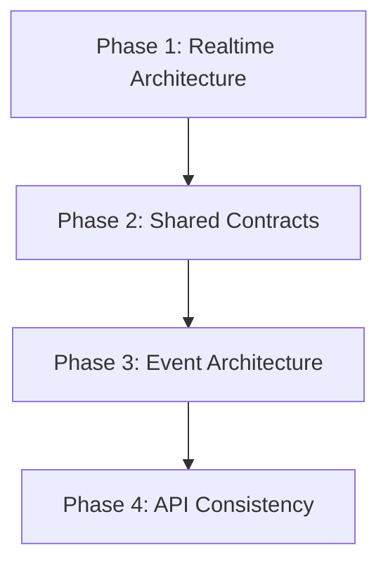

# Updated Implementation Roadmap

## Phase 1 — Realtime Architecture
* Restructure Realtime into bounded capabilities (auth, gateways, matchmaking, rooms, presence, delivery, events, redis, registry, shared).
* Separate connection lifecycle, matchmaking, messaging, and event handling into cohesive modules.
* Remove large, multi-responsibility files.

## Phase 2 — Shared Contracts
* Expand `packages/contracts` into the canonical platform package.
* Move all shared DTOs, Zod schemas, WebSocket payloads, Redis command/event payloads, enums, capabilities, JWT claims, actor types, identity states, and error codes into it.
* Eliminate duplicated definitions across API, Realtime, and Frontend.

## Phase 3 — Event Architecture
* Introduce a proper `EventBus` abstraction.
* Standardize event naming and versioning.
* Ensure API owns business events and Realtime owns delivery.
* Strengthen the Outbox → Redis → Realtime flow.

## Phase 4 — API Consistency
* Bring messages and policy into the same domain structure as every other business domain.
* Finish standardizing all domains around the same folder conventions.
