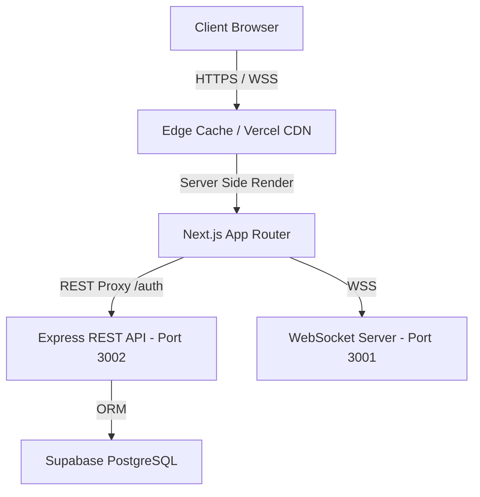

# Moots Frontend (Client) - Implementation & Engineering Plan

This document outlines the architectural blueprints, performance budgets, security specifications, and milestones for the **Next.js Frontend Client** (`frontend/web`), structured in alignment with industry-standard engineering guidelines.

---

## 1. Architectural Architecture & Design



### Framework Core
- **Next.js 15 (App Router)**: Hybrid rendering model using React Server Components (RSC) by default for pages/layouts, and Client Components ('use client') exclusively for interactive leaves (chat feeds, toggle forms).
- **TypeScript**: Strict type check execution (`strict: true`) across all app routers and component states.
- **Styling**: Vanilla TailwindCSS + Tailwind CSS Animate + Radix UI primitives (`shadcn/ui`) for uniform, themeable components.

### Routing Architecture
- **`(auth)` Route Group**: Handles `/login`, `/signup`, and `/verify` forms.
- **`(dashboard)` Route Group**: Serves as the primary app workspace. Shares a sticky left panel navigation (`SidebarNav`).
  - `/chat`: Anonymous chat configuration entry.
  - `/chat/[sessionId]`: Dynamic peer-to-peer real-time session view.
  - `/friends`: Authenticated social contacts dashboard.
  - `/groups`: Group/community interest hub.
  - `/notifications`: Live account/activity logs.
  - `/settings`: Account configuration profile.

---

## 2. State & Lifecycle Management

Moots features a decoupled state architecture to minimize render cycles and ensure smooth interactions.

| State Domain | Primary Tech | Scope & Lifespan |
| :--- | :--- | :--- |
| **Authentication** | NextAuth.js v5 (Auth.js) | JWT session with secure HTTP-only cookies |
| **Real-time Chat** | WebSocket WebAPI + Refs | Stateful only during active P2P session |
| **Theme / UI** | `next-themes` | Persistent across page reloads (Local Storage) |
| **Matchmaking** | WebSocket connection | Preserved in `sessionStorage` for temporary refreshes |

### Memory & Hook Best Practices:
1. **Ref-based Connection Management**: Avoid storing the active `WebSocket` instance in React state. Maintain it inside a `React.useRef` to prevent unnecessary component re-renders.
2. **Graceful Disconnect Audits**: Always clean up event listeners, clear timers (`setInterval` / `setTimeout`), and terminate open WebSocket sockets within the `useEffect` cleanup return closure.
3. **Session Interceptor**: Fetch session data only where required (`useSession` hook or `auth()` in server components) to prevent blocking the initial paint of public/guest routes.

---

## 3. Performance & Core Web Vitals Budget

Our target is to maintain a **95+ Lighthouse Performance Score** across mobile and desktop.

### Performance Budgets
- **First Contentful Paint (FCP)**: < 1.0s
- **Largest Contentful Paint (LCP)**: < 2.0s
- **Cumulative Layout Shift (CLS)**: < 0.05
- **Interaction to Next Paint (INP)**: < 100ms

### Optimization Strategy
- **Font Subsetting**: Bundle Google Fonts locally using `@next/font/google` with `display: swap` fallback.
- **Dynamic Imports**: Code-split large third-party modules (e.g., sound cues, markdown parsers, heavy emojis) using `next/dynamic` with skeleton loading states.
- **Bundle Budgets**: Enforce a maximum initial JavaScript payload size of **120kb (gzipped)** per page.

---

## 4. Security & Compliance Specifications

To safeguard both authenticated accounts and guest visitors, we enforce a strict security policy.

- **Cross-Site Scripting (XSS) Prevention**: All chat messages must be sanitised before rendering. Avoid using raw `dangerouslySetInnerHTML` for message feeds unless utilizing a secure sanitizer library like `DOMPurify`.
- **Cross-Site Request Forgery (CSRF)**: All state-changing requests use Next.js Server Actions or API routes, utilizing CSRF protection tokens natively managed via NextAuth.
- **Authentication Guarding**:
  - Authenticated pages (`/settings`, `/friends`, `/groups`, `/notifications`) must perform route redirection within NextAuth middleware before rendering the component tree.
  - Guest/Anonymous pages must allow clean entry without force-redirecting to the `/login` screen.

---

## 5. Developer Experience (DX) & Testing Strategy

To ensure code resilience and prevent regressions, all components must undergo testing before merging to `main`.

### Code Quality Guards
- **Linting**: Strict ESLint ruleset (`next/core-web-vitals` + TypeScript rules).
- **Formatters**: Automated Prettier formatting on pre-commit hooks.

### Testing Matrix
```
[Unit Tests (Vitest)] -> [Integration Tests (React Testing Library)] -> [End-to-End Tests (Playwright)]
```

- **Unit Testing**: Target helper functions, date formatters, and theme toggles.
- **Integration Testing**: Validate form elements (login, signup, verification) with simulated network responses.
- **End-to-End (E2E) Testing**: Validate the core matchmaking flow and real-time message exchange between two automated browser instances using Playwright.

---

## 6. Implementation Milestones & Checklist

- [x] **Milestone 1: Architecture Setup & Client decoupling**
  - [x] Configure NextAuth Credentials Provider.
  - [x] Setup unified REST API proxy to decouple Next.js from database calls.
  - [x] Create base layout structure with Radix UI sidebar navigation.

- [x] **Milestone 2: Guest-First Authorization**
  - [x] Modify NextAuth middleware config to allow guest access to `/chat` and dynamic chat subroutes.
  - [x] Adapt `SidebarNav` to support Guest states with anonymous fallbacks and conditionally hide or prompt for login on authenticated features.

- [/] **Milestone 3: Chat Polishing & Audio Cue Integration**
  - [ ] Integrate local audio player for matchmaking alerts and incoming message notifications.
  - [ ] Implement typing status indicator bubbles synchronized via WebSocket events.
  - [ ] Add visual feedback (unreads, message delivery status icons).

- [ ] **Milestone 4: Progressive Web App (PWA) & Notifications**
  - [ ] Setup Service Worker registration hooks.
  - [ ] Configure manifest and splash screens optimized for mobile platforms.
  - [ ] Implement Push API subscription handler to notify users of friends' direct messages offline.

- [ ] **Milestone 5: End-to-End Performance Audit**
  - [ ] Optimize next-image components.
  - [ ] Conduct Lighthouse auditing and adjust dynamic code-splitting.
  - [ ] Implement automated Playwright verification suites.
