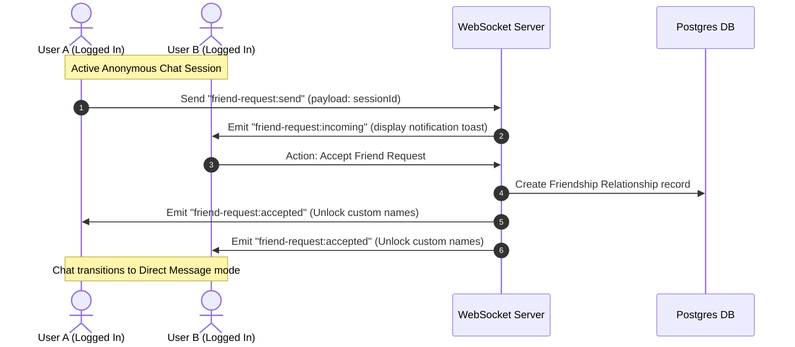
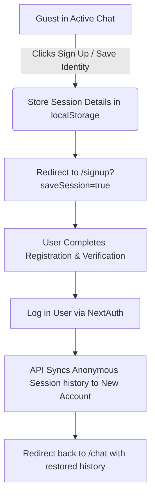

# Moots - Logged-in User Experience & User Flows

This document details the user flows, page layouts, API interaction logic, and state transitions for **authenticated users** across the Moots platform.

---

## 1. Social Core: Friends List & Direct Messages (`/friends`)

The social hub allows authenticated users to manage friendships and transition from random chats into persistent contacts.

### A. Add Friend from Random Chat Flow

### B. Navigation & Page Flow
1. **Friends List View (`/friends`)**:
   - Displays three tab categories: **All Friends**, **Online**, **Pending Requests**.
   - For each friend, displays: Avatar, Username, Status indicator (Online, Offline, In a match).
   - Action controls: Open Chat, Remove Friend, Block.
2. **Direct Messaging (`/chat/[friendId]`)**:
   - Launches a secure chat channel with standard messaging UI.
   - Saves conversations to the DB using paginated historical loading (`/api/chat/history?friendId=X`).
   - Standard typing indicators and message delivery statuses (Sent, Delivered, Read).

---

## 2. Communities & Group Chats (`/groups`)

Groups allow multiple authenticated users to engage in interest-oriented chat rooms.

### A. Join & Active Chat Flow
- **Discovery**: User visits `/groups` and browses public rooms sorted by popularity or tags.
- **Join Action**: Clicking "Join Room" checks if the user is logged in. 
  - *Logged-in*: Direct entry into the room, saving the group to their sidebar.
  - *Guest*: Redirects to `/login` with callback redirect query (`?callbackUrl=/groups/join/[groupId]`).
- **Group Workspace Layout**:
  - **Left Area**: List of active group channels.
  - **Center Area**: Multi-user scrollable message feed.
  - **Right Area**: Sidebar of active online participants.

---

## 3. Real-Time Notifications Hub (`/notifications`)

Active user notifications are managed dynamically to prevent missing requests or messages.

### A. Flow Matrix
- **Friend Requests**:
  - Received: Displays toast notification + increments badge counter on sidebar.
  - Accept: Instantly moves the user card from "Pending" to the "Online" tab in `/friends`.
- **System / Security Alerts**:
  - Triggers on login from unrecognized IP, password changes, or moderator flags.
  - Displays as read-only alert banner with redirect to settings/security logs.

---

## 4. Settings & Account Profile (`/settings`)

The account dashboard where users modify their security posture and custom parameters.

### A. Layout Structure
- **Profile Configuration**:
  - Update username, email address, password.
  - Update avatar image (integrating file upload to backend/Supabase storage).
- **Matchmaking Preferences**:
  - **Safe-Search Match**: Filter peers based on moderator flags (default: enabled).
  - **Language Filter**: Define primary matching languages (e.g., English, Hindi, Spanish).
- **Data Privacy**:
  - **Download My Data**: Triggers legal data export request.
  - **Delete Account**: Triggers multi-step confirmation warning before executing DB cleanup.

---

## 5. Transition Flows: Guest to Authenticated

To preserve session engagement when a guest decides to sign up/log in:

